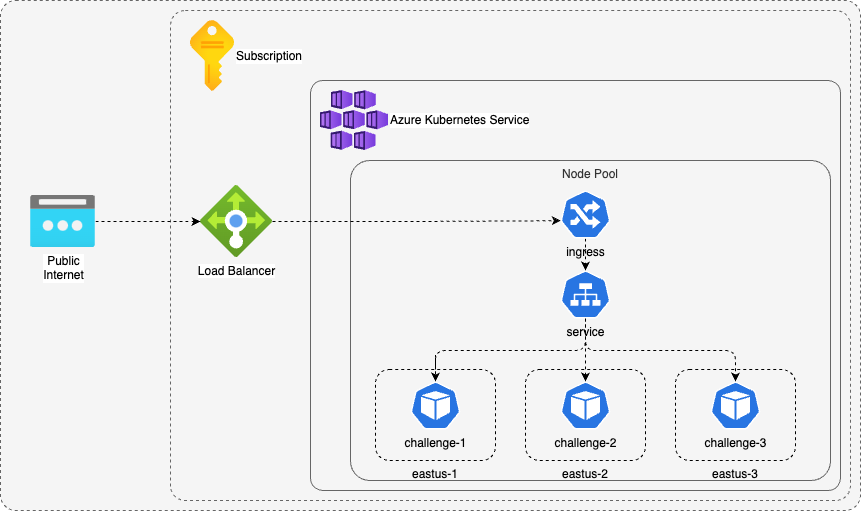

<p align="center">

</p>

# Challenge - Luiz Mandico
---
<p align="center">


</p>

<p align="center">


</p>

### Pré-requisitos
- [Go](https://golang.org/doc/install) (versão 1.22.2 ou superior)
- [Docker](https://docs.docker.com/get-docker/)
- [Helm](https://helm.sh/docs/intro/install/)
- [Terraform](https://www.terraform.io/downloads.html)
- [Kubectl](https://kubernetes.io/docs/tasks/tools/)

--- 
### Executando o Projeto

1. **Clone o Repositório**
   ```sh
   git clone https://github.com/mandico/challenge-backend-itau.git
   cd challenge-backend-itau
   ```

2. **Execucao Local**
   ```sh
   cd code
   go run cmd/main.go
   ```

---

### Métodos da Aplicação

#### ValidateJwt
Esta função é a principal responsável por validar um token JWT. Ela utiliza várias funções auxiliares para realizar diferentes etapas da validação, como decodificação do token, verificação do método de assinatura e extração e validação dos claims.

#### parseToken
Esta função decodifica o token JWT usando a chave secreta fornecida. Ela retorna o token decodificado ou um erro, se houver.

#### validateTokenMethod
Esta função verifica se o método de assinatura do token é o esperado (HMAC). Se o método de assinatura for diferente, ela retorna um erro.

#### extractClaims
Esta função extrai os claims do token JWT e verifica se o token é válido. Ela retorna os claims extraídos ou um erro, se houver.

#### validateClaims
Esta função valida os claims específicos do token, como Role, Seed, e verifica se há mais de 3 claims. Ela retorna um erro se qualquer uma das validações falhar.

#### hasMoreThanThreeClaims
Esta função verifica se o token possui mais de 3 claims. Ela retorna true se houver mais de 3 claims e false caso contrário.

#### isPrime
Esta função verifica se um número é primo. Ela retorna true se o número for primo e false caso contrário.

---

### Estrutura Repositório

```
.
├── .github
│   └── workflows
│       ├── iac_azure.yml                      >>> Workflow Pipeline IaC
│       └── pipeline.yml                       >>> Workflow Pipeline Application
├── Insomnia.yaml                              >>> Colections Insomnia
├── README.md                                  >>> README
├── chart                                      >>> Estrutura Helm Chart
│   └── challenge
│       ├── Chart.yaml
│       ├── charts
│       ├── templates
│       │   ├── NOTES.txt
│       │   ├── _helpers.tpl
│       │   ├── deployment.yaml
│       │   ├── ingress.yaml
│       │   └── service.yaml
│       └── values.yaml
├── code                                       >>> Estrutura Código Fonte
│   ├── Dockerfile                             >>> Dockerfile
│   ├── cmd
│   │   └── main.go
│   ├── go.mod
│   ├── go.sum
│   └── internal
│       ├── controller
│       │   ├── jwt_controller.go
│       │   └── jwt_controller_test.go         >>> Testes Unitários
│       └── service
│           ├── jwt_service.go
│           └── prime.go
├── docs
│   ├── architecture.drawio
│   └── img
│       ├── architecture.png
│       ├── cd.png
│       ├── ci.png
│       └── itau.png
├── iac                                        >>> Infrastructure as Code
│   └── azure
│       ├── main.tf
│       └── variables.tf
└── requests.http                              >>> Collection REST Client
```
---

### Pipeline CI/CD


---

### Arquitetura / Resiliência

```
kubectl get nodes -o custom-columns=NAME:'{.metadata.name}',REGION:'{.metadata.labels.topology\.kubernetes\.io/region}',ZONE:'{metadata.labels.topology\.kubernetes\.io/zone}'
NAME                              REGION   ZONE
aks-default-35285299-vmss000000   eastus   eastus-2
aks-default-35285299-vmss000001   eastus   eastus-3
aks-default-35285299-vmss000002   eastus   eastus-1


kubectl get pods -n challenge -o wide
NAME                         READY   STATUS    RESTARTS   AGE   IP           NODE                              NOMINATED NODE   READINESS GATES
challenge-5f694b8f7b-hdr9v   1/1     Running   0          22m   10.244.1.8   aks-default-35285299-vmss000001   <none>           <none>
challenge-5f694b8f7b-m2sms   1/1     Running   0          22m   10.244.2.3   aks-default-35285299-vmss000002   <none>           <none>
challenge-5f694b8f7b-psz9m   1/1     Running   0          22m   10.244.0.6   aks-default-35285299-vmss000000   <none>           <none>
```
